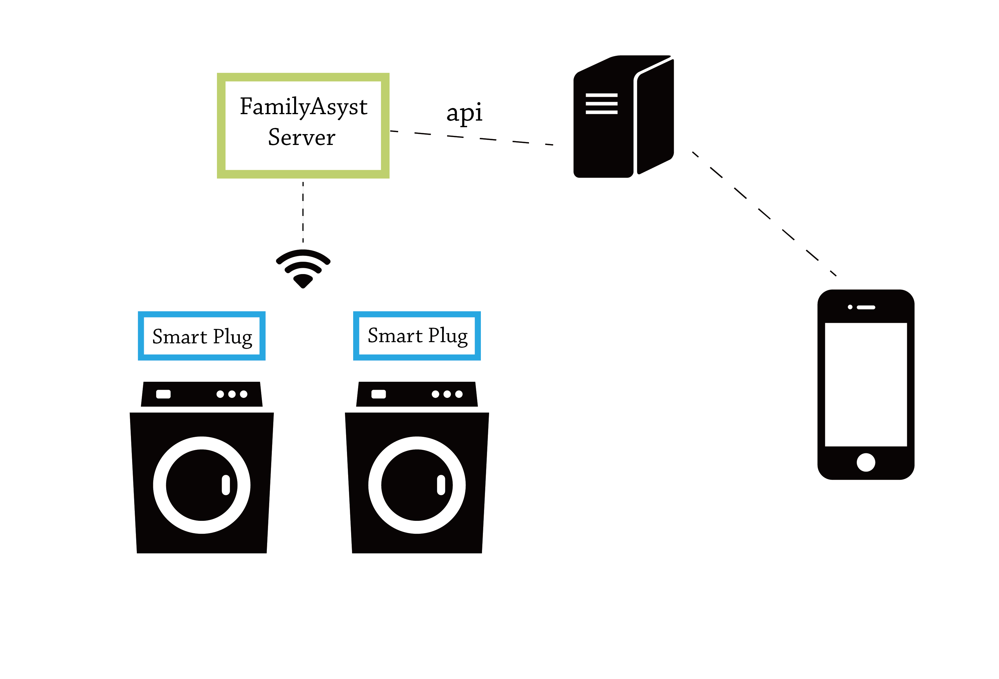
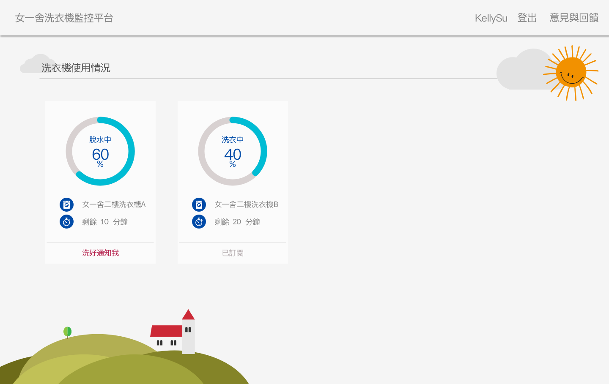
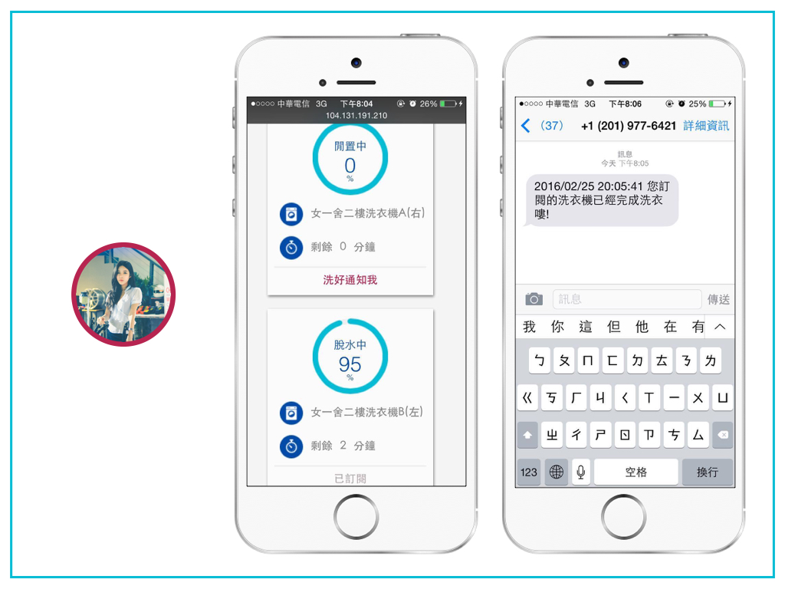

## 臺大女一舍洗衣機監控平台
##### Washing Machine Monitoring Platform of NTU Girls' Dorm

Washing Machine Monitoring Platform of NTU Girls' Dorm
In NTU school dorm, about 60 students have to take turns to use one washing machine. There is a problem in this kind of situation. Students usually forget to pick up their clothes when their laundry is done. The next user of the washing machine sometimes is in a hurry to do their laundry, will throw former user's clothes at a random place in the laundry room or pile them up on top of another washing machine. After that, the clothes easily fell off to the ground and get dirty again.

Therefore, we made a monitoring platform that allows everyone to see the current state(washing, rinsing, spinning, etc.) of the washing machines in the school dorm. Also, we created a subscription service. If a user subscribes a washing machine, we will send text messages to her when it finishes washing.

We believe that by showing current washing machine status and reminding users to pick up their clothes will solve this problem.

We use ``Node.js``, ``Express.js``, ``Angular.js``, and ``MySQL`` to build the app.
There are two parts of our app. The [DataFatcher](https://github.com/cosrick/dataFetcher) fetches data from smart plug API, watches the pattern of electric current and determines the current state. The second one is this repository, including all front-end pages and APIs of subscription data and user data.

## System Structure

## ScreenShot

## Achievement

